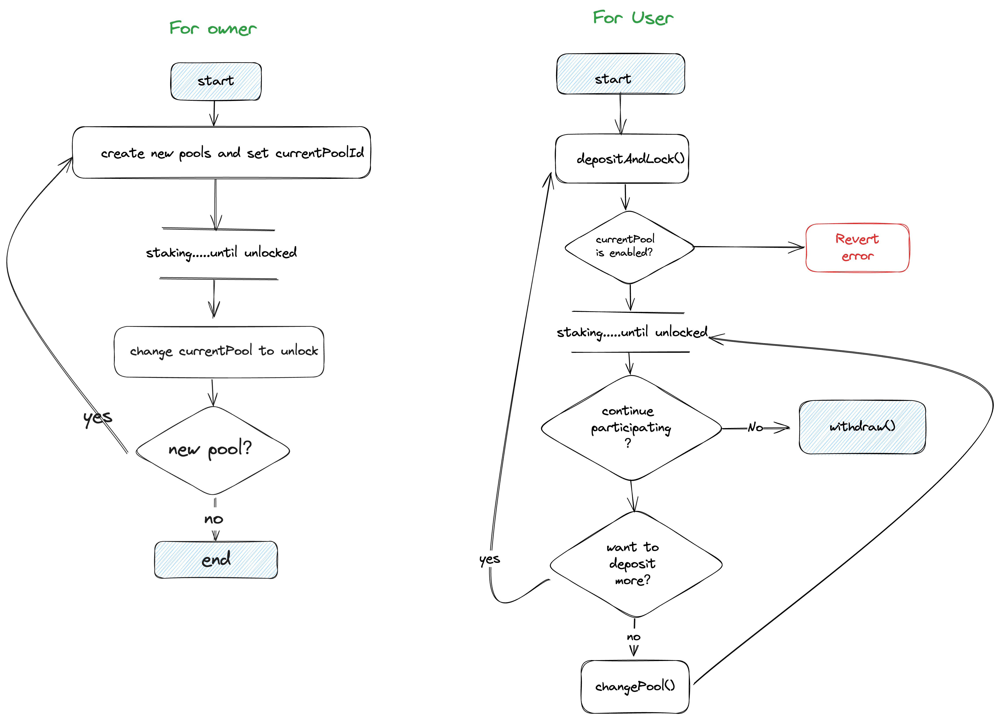

# Stake Mask

## Function Briefing in `StakeManager.sol`

### General Description

The staking pool is divided into multiple pools, and the administrator can add pools and manage the parameters "unlocked" and "stakingEnabled" of the `pool` to manage users' staked assets. Each participating user has a `UserInfo`, which stores the total stakedAmount in the pool and information about the current pool they are in.

### Workflow in stake manager



1. Users need to call `approve()` in advance to approve of our contract to operating users' token.
2. Users call `depositAndLock(_amount)` to unlock token in current active pool to get point.
3. When this pool unlocked. Owner of the contract will unlock this pool, create a new pool and set the `currentPoolId` to new pool.
4. Users can call `depositAndLock(_amount)` to deposit and lock more token on next pool to participate in the next stage of the event. or call `changePool(_newPoolId)` to relocked token to participate in the next stage of the event. or call `withdraw(_amount)` to withdraw token. If users don't take any action, their assets in the pool won't generate points in the next stage of the event.

### API

### depositAndLock

Users can deposit and lock mask token on StakeManager to get Point.
depositAndLock will change UserInfo.poolId to currentPoolId.

```solidity
function depositAndLock(uint256 _amount) public {}
```

- parameters:
  - `_amount`: Amount of locking Mask tokens
- Requirements:
  - currentPool.stakingEnabled == true
  - enough allowance of mask token
- Events:

  ```solidity
  Staked(address indexed account, uint8 indexed poolId, uint256 stakedAmount);
  ```

### changePool

Users can compound their mask token to new pool.

```solidity
function changePool() public {}
```

- parameters:
  N/A
- Requirements:
  - toPool.stakingEnabled == true
  - fromPool.unlocked == true
- Events:

  ```solidity
  StakeChanged(address indexed account, uint8 indexed fromPoolId, uint8 indexed toPoolId);
  ```

### withdraw

Users can withdraw mask token when pool is unlocked.

```solidity
withdraw(uint256 _amount) public {}
```

- parameters:
  - `_amount`: Amount of withdrawing Mask tokens
- Requirements:
  - pools[userInfos[msg.sender].poolId].unlocked == true
  - userInfos[msg.sender].stakedAmount >= \_amount
- Events:

  ```solidity
  unstaked(address indexed account, uint8 indexed poolId, uint256 unStakedAmount);
  ```
